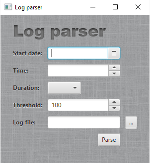

[](https://travis-ci.org/javiersvg/log-parser)
[](https://sonarcloud.io/dashboard?id=log-parser)

# MySQL log parser

This is a log parsing application meant to store in a mysql database entries from a log
that have exceeded a determined threshold in a given period of time.

## Project
The project consists of three sub projects:
 ### Core
 Library that contains the logic implementation as well as the sql script to create
 the database and query the entries. This project currently counts with a coverage of 70%
 as can be seen in the sonar cloud report. This module has been designed with a puristic
 OO design in mind and having present the concepts of elegant objects. The only required
 external library to run the program is the MySQL jdbc driver.
 ### Command line client
 A client meant to start the pare process reading parameters from the command line.
  
 To run this client unzip the distribution file generated by this project and run the
 mysql-log-parser-command-line file (.bat or .sh) file inside the bin folder with the
 parameters in the following format:
 --startDate=2017-01-01.13:00:00 --duration=daily --threshold=250
 
 This client can also be run from the source code with the following command:
 ```
 ./gradlew mysql-log-parser-command-line:run
 ```
 
 ### Javafx client
 A client to run the program from a JavaFx window.
 
 To run this client unzip the distribution file generated by this project and run
 the mysql-log-parser-application file (.bat or .sh) inside the bin folder and will be prompted with a window as
 follows.
 
 
 
  This client can also be run from the source code with the following command:
  ```
  ./gradlew mysql-log-parser-application:run
  ```
  
  ### Extras
  To configure the database connection set the properties in the config.properties file 